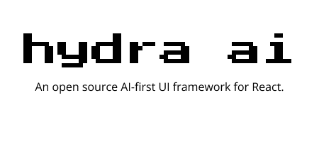

<p align="center">
  
</p>

Generate React components on-the-fly at runtime using AI. Register your components, and let Hydra choose when to show them in your App.

```typescript
const dynamicComponent = await hydra.generateComponent(context);
```

### Chat with the Team

[](https://discord.gg/TNgMMAUedB)

Hydra development is still early, and patterns for different types of components and apps are still being developed.

## This Repo

- `hydra-ai` package is here: [/package](/package)

- Example apps that use `hydra-ai`:
  - Charts app here [/examples/charts-demo](/examples/charts-demo/)
  - Social app (Mage) here: [/examples/mage-demo](/examples/mage-demo)
  - ToDo app demo here: [/examples/todo-app-demo](/examples/todo-app-demo/)
  - Weather app demo here: [/examples/weather-app-demo](/examples/weather-app-demo/)

## Use Cases

The clearest use case is in chat-based applications. If you have a ChatGPT style app that lets a user chat with an AI, Hydra lets your AI respond with interactive components instead of just text. Interacting through natural language is often a great experience, but sometimes a user needs more.

Some examples that enhance a chat-based app:

- **Forms:**
  - If a user wants to login to service, or create a new entry, Hydra can show them a form with the required fields.
- **Visual Information:**
  - If a user asks something like, "I want to see available T-Shirts," Hydra can show a list of Product Cards with images.
  - If a user is asking about trends or comparisons, Hydra can respond with an interactive graph.
- **Interactive Components:**
  - If a user asks to see a list of ToDo items, Hydra can respond with a list of ToDo components, where the user can then click to mark them as done.

In general, beyond chat apps, we imagine that the UX of an app could be completely controlled by Hydra.

## Getting Started

To use Hydra in your own NextJS app, follow the instructions in the package's readme [here.](/package/README.md)

To run one of the example apps, follow the instructions in that example's readme. Charts app instructions [here.](/examples/charts-demo/README.md)

## How is this different from Vercel V0?

We've been asked this a few times. For clarification, Vercel V0 lets you generate a component that you can copy/paste into your app's code. Hydra is for injecting components into your running app's UI on-the-fly based on context.

## Report a bug or Request a feature

Make a GitHub issue [here.](https://github.com/michaelmagan/hydraai/issues/new)
